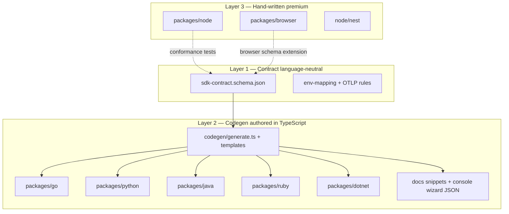

# Multi-language SDK architecture (single repo, one authoring stack)

Deep design for shipping **Go, Java, Python, Ruby, .NET, Node, and browser** integrations from **`owlpane-sdk`** without maintaining seven unrelated codebases.

**Not the goal:** transpile TypeScript into Java/Go (fragile, non-idiomatic, untestable).  
**The goal:** one **contract**, one **codegen pipeline** (authored in TypeScript), **hand-written** where OpenTelemetry already differs per platform.

References: [Pulumi multi-language providers](https://github.com/pulumi/pulumi) (schema → native SDKs), [pulumi-java](https://github.com/pulumi/pulumi-java) (language host, not TS→JAR compilation), Owlpane [plain OTel guides](../../../api/docs/reference/opentelemetry-any-language.md).

---

## 1. Problem statement

| Stakeholder need | Constraint |
|------------------|------------|
| Customers use Java, Python, Go, Ruby, Nest, React | OTel is the real runtime; Owlpane adds **opinionated defaults + keys + console alignment** |
| One repo (`owlpane-sdk`) | CI, versioning (`sdk-v*`), security review in one place |
| Security teams | Small surface, no dynamic code load, keys write-only |
| Engineering cost | Cannot afford 7 full ports of `@owlpane/node` (~300 LOC + OTel wiring) |

**Surface area today (`@owlpane/node`):**

- `start(InitOptions)` — env resolution, OTLP exporters, sampler, auto-instrumentation list, logs/metrics
- `shutdown()`, `isEnabled()`
- `job(name, kind, attrs, fn)` — root span + histogram
- `setUser(id, profile?)` — enduser attributes
- `@owlpane/node/nest` — framework-specific (**never generated**)
- `@owlpane/browser` — RUM, vitals, replay (**never generated**)

Only the **portable subset** is a candidate for multi-language parity; the rest stays language-specific.

---

## 2. Three-layer model



| Layer | Source of truth | Output |
|-------|-----------------|--------|
| **1. Contract** | JSON Schema (+ optional `browser-init.schema.json`) | Validation, docs, wizard copy |
| **2. Thin starters** | Templates per language | Maven/PyPI/Go module gems that **configure official OTel** |
| **3. Premium** | TypeScript only | Node + browser + Nest |

---

## 3. Why JSON Schema, not TypeScript, as the contract

| Approach | Verdict |
|----------|---------|
| **TS types as SOU** | Drift: Java team reads outdated Javadoc; codegen from TS needs `ts-morph` and breaks on refactors |
| **JSON Schema / OpenAPI subset** | Pulumi-like: validate in CI; generate TS types *from* schema for node if desired |
| **Protobuf** | Wrong tool (OTLP protos are upstream; Owlpane config is 10 fields) |
| **Smithy** | Heavy; justified for AWS-scale APIs |

**Authoring language for the repo:** **TypeScript** runs codegen (`codegen/generate.ts`), tests, and hand-written packages. **Contract language:** **JSON Schema** in `schema/`.

---

## 4. Package tiers

### Tier A — Full (`packages/node`, `packages/browser`)

- Maintain by hand in TypeScript.
- Publish: npm (`@owlpane/node`, `@owlpane/browser`).
- **Conformance:** unit tests assert resolved config matches schema given env fixtures.

### Tier B — Thin starters (generated + small hand glue)

Each thin package does **only**:

1. Resolve `InitOptions` from env (names from schema).
2. Build `Authorization: Bearer <key>` and OTLP base URL.
3. Set resource: `service.name`, `service.version`, `deployment.environment.name`.
4. Delegate to **official OTel**:
   - **Java:** document `-javaagent:opentelemetry-javaagent.jar` + env; optional tiny `owlpane-java` lib that sets `OTEL_EXPORTER_OTLP_HEADERS` in `main` before agent loads (agent must be configured via env only — **documented pattern**).
   - **Python:** `opentelemetry-instrument` entrypoint wrapper or `OwlpaneConfigurator` called before app import.
   - **Go:** `otel` SDK setup in ~80 lines; generated struct + `Start(ctx)`.
   - **Ruby:** `OpenTelemetry::SDK.configure` block from template.
   - **.NET:** `OpenTelemetry.Sdk` builder extension `AddOwlpane()`.

5. Implement **`job` / `setUser` / `shutdown`** in idiomatic code (templates + one shared spec in schema for attribute names).

**Do not generate:** auto-instrumentation lists (copy from node as **documented defaults** in schema `instrumentationDefaults.node` later).

### Tier C — Docs-only (until generated package ships)

`examples/apps/*` (dogfood, published SDKs) and `examples/conformance/*` (local receiver). Console install guide reads schema JSON.

---

## 5. Repository layout (target)

```text
owlpane-sdk/
  schema/
    sdk-contract.schema.json       # server portable API
    browser-init.schema.json       # later: RUM options subset
    CHANGELOG-schema.md            # semver for contract bumps
  codegen/
    package.json                   # typescript, zod, json-schema-to-typescript, handlebars
    generate.ts                    # reads schema, writes packages/* + generated/
    templates/
      go/   java/   python/   ruby/   dotnet/
    conformance/
      resolve-config.test.ts       # golden env → resolved InitOptions
  packages/
    node/          # hand
    browser/       # hand
    go/            # generated + otel_bootstrap.go (hand stub, <100 LOC)
    python/owlpane/
    java/owlpane-java/
    ruby/owlpane/
    dotnet/Owlpane/
  examples/        # thin samples; CI runs against _receiver
  docs/
    MULTILANGUAGE-SDK-ARCHITECTURE.md
  scripts/
    verify-generated.sh            # git diff --exit-code after codegen
```

**Versioning:** single tag `sdk-v1.2.3` bumps all packages; contract `version` field increments on breaking env renames.

---

## 6. Codegen pipeline (implementation plan)

### Phase 0 — Contract only (**done:** `schema/sdk-contract.schema.json`)

- [ ] Add `browser-init.schema.json` from `OwlpaneBrowserOptions`.
- [ ] `npm run schema:validate` — ajv against examples in `schema/fixtures/`.

### Phase 1 — Config resolver (TypeScript, shared)

Generate **or** hand-write once in `codegen/lib/resolve-config.ts` (used by tests + node optional):

```ts
// Pseudocode: same logic as packages/node/src/index.ts endpointOf(), sampleRatio(), etc.
export function resolveInitOptions(env: Record<string, string>, options?: Partial<InitOptions>): ResolvedConfig | null
```

Golden tests: 20 env fixtures → expected headers + resource attrs. **Node package refactors to call this** (optional) to prove single logic.

### Phase 2 — Template codegen

Tool choice: **Handlebars** or **Eta** templates in TypeScript (no new binary deps). Alternatives evaluated:

| Tool | Fit |
|------|-----|
| OpenAPI Generator | Overkill; no REST client |
| Protoc | Wrong domain |
| Pulumi gen | Coupled to Pulumi schema |
| **Custom TS + templates** | Full control, small API |

Per language outputs:

| Lang | Artifact | Registry |
|------|----------|----------|
| Go | `github.com/owlpane/owlpane-go` | Go modules |
| Java | `com.owlpane:owlpane-java` | Maven Central |
| Python | `owlpane` | PyPI |
| Ruby | `owlpane` | RubyGems |
| .NET | `Owlpane.OpenTelemetry` | NuGet |

Each includes: `README.md` (generated), `LICENSE`, minimal `start/shutdown/job/setUser`.

### Phase 3 — CI matrix

```yaml
# .github/workflows/ci.yml (extend)
jobs:
  schema:
    - validate schema
    - codegen
    - git diff --exit-code packages/go packages/python ...
  test-node-browser: ...
  test-go: go test ./...
  test-java: mvn test
  test-python: pytest
```

### Phase 4 — Console integration

Export `schema/install-snippets.json` from codegen:

```json
{ "java": { "env": ["OTEL_EXPORTER_OTLP_ENDPOINT=...", "OWLPANE_INGEST_KEY=..."], "agentJar": "..." } }
```

Console **Connect app** wizard loads this (no duplicate copy).

---

## 7. Java / agent nuance (critical)

The **Java agent** is a **JAR from OpenTelemetry**, not generated from TS.

Thin `owlpane-java` options:

1. **Env-only (recommended):** codegen produces **only** documentation + `owlpane.env` sample file.
2. **Bootstrap helper:** small class that sets system properties before `main` — limited because agent loads early.
3. **Agent extension:** future `owlpane-javaagent-extension.jar` for custom samplers — **Phase 5**, not codegen from Node.

Same pattern for **Python** `opentelemetry-instrument` — wrapper script generated, not transpiled instrumentation.

---

## 8. Security properties (all languages)

| Property | Enforcement |
|----------|-------------|
| Key never in logs | Generated code uses redacted debug |
| No-op without endpoint | Required in schema `portableApi.start` |
| No network except OTLP | Static analysis + review template |
| Dependency pinning | Renovate per package; SBOM on release |
| Contract tests | Receiver test (`examples/_receiver`) per language in CI |

---

## 9. What we explicitly will not do

- Compile TS → JVM bytecode / Go
- Fork OpenTelemetry instrumentations
- Put console session tokens in any SDK
- Generate Nest or browser RUM from schema (browser schema is separate, still hand-implemented)

---

## 10. Effort estimate

| Phase | Engineering | Customer-visible |
|-------|-------------|------------------|
| 0 Contract + golden resolver | 1–2 weeks | Accurate docs |
| 1 Go + Python thin | 2–3 weeks | `pip install owlpane`, `go get` |
| 2 Java + .NET | 2 weeks | Maven + NuGet |
| 3 Ruby + CI matrix | 1 week | RubyGems |
| 4 Console snippets | 3 days | Wizard |

**Node/browser** remain ~80% of DX value; thin starters unlock **security questionnaire** (“we have a supported library”) for other stacks.

---

## 11. Immediate next steps

1. Merge `schema/sdk-contract.schema.json`; add AJV validation in CI.
2. Implement `codegen/lib/resolve-config.ts` + tests mirroring `packages/node/src/index.ts`.
3. Add `npm run codegen` + Go template as first generated package.
4. Document in [customer onboarding playbook](../../../api/docs/ops/customer-onboarding-playbook.md) §3.

---

## 12. Decision record

| Decision | Rationale |
|----------|-----------|
| Single repo `owlpane-sdk` | One tag, one security review |
| Contract = JSON Schema | Language-neutral, Pulumi-like |
| Codegen driver = TypeScript | Team already lives in TS; templates are data |
| Thin vs full tiers | OTel owns instrumentation; Owlpane owns config + job/setUser semantics |
| Browser/Node hand-written | RUM and Nest are not portable |
